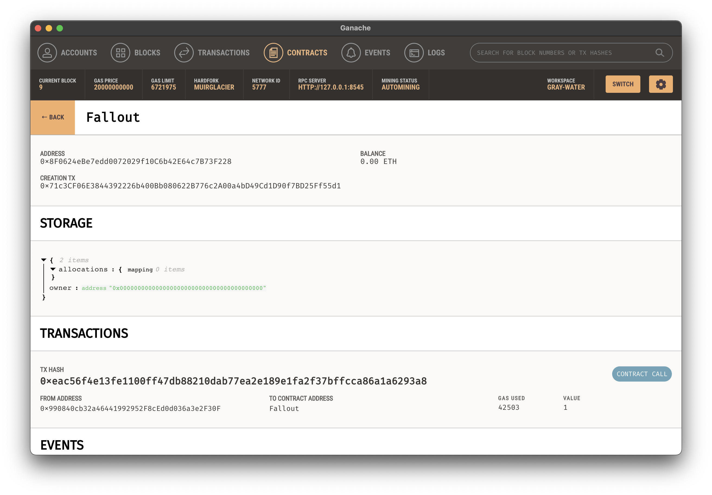

## 2. Fallout

### 题目分析

所谓的构造函数

```sol
  /* constructor */
  function Fal1out() public payable {
    owner = msg.sender;
    allocations[owner] = msg.value;
  }
```

实际上就是一个普通的函数，合约构造完成后也可以调用，攻击者可以调用该函数修改合约敏感的内部状态。

实际上solidity中的构造函数语法参见 https://docs.soliditylang.org/en/v0.8.10/contracts.html#constructor 例如：

```
// SPDX-License-Identifier: GPL-3.0
pragma solidity >=0.7.0 <0.9.0;

abstract contract A {
    uint public a;

    constructor(uint _a) {
        a = _a;
    }
}

contract B is A(1) {
    constructor() {}
}
```

其中的constructor中对应的代码只会在合约被部署时执行一次，

本题中合约没有实现constructor，因此其构造函数默认为空。因此查看部署后的该合约的storage，可以看到各项均为0（未初始化）


### 本地复现

尝试配置环境在本地复现题目环境。使用技术栈为truffle+ganache+typescript+ethers.

首先安装ganache，这里选择带图形界面的版本。然后创建两个项目：

```
.
├── README.md
├── fallout    # 用于编译和部署合约
└── play       # 用于写代码乱搞
```

使用`truffle init`在`fallout`文件夹下初始化项目，然后编辑truffle配置文件，设置部署到区块链时选择的provider：

```
    networks: {
        development: {
            network_id: "5777",
            provider: () => {
                return new HDWalletProvider(dev_mnemonic, "http://localhost:8545")
            }
        },
        rinkeby: {
            provider: function() {
                return new HDWalletProvider(mnemonic, api);
            },
            network_id: 4,
            gas: 4500000,
            gasPrice: 10000000000,
        }
    },
```

将合约放到contracts文件夹下，并在migrations文件夹下创建对应的迁移脚本，然后运行`truffle compile`编译，运行`truffle migrate --network development`部署合约到本地测试链。

最后在play文件夹下创建typescript项目，使用ethers库与部署到链上的合约进行交互即可。

