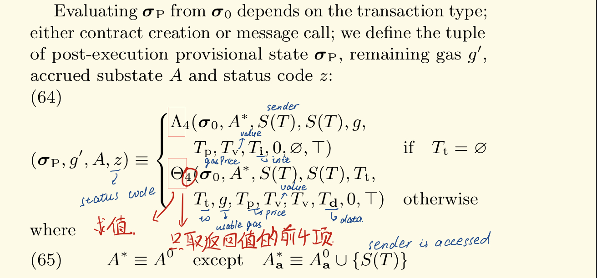
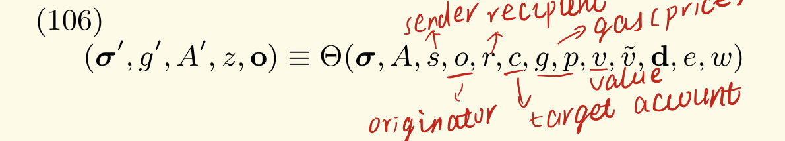
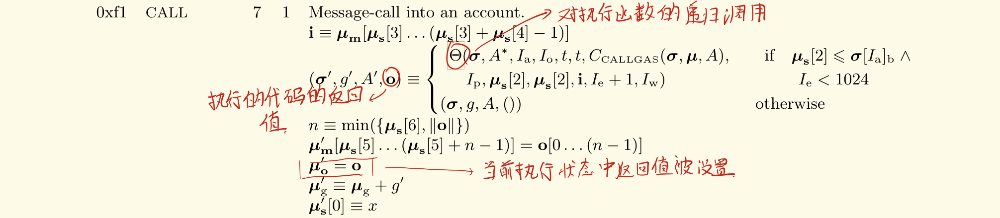

## 3. Coin Flip

我们可以通过一个Attack合约来调用该合约，从而在flip函数之前得知当前交易的block number。作为攻击者，当我们调用攻击合约的交易被放到区块中时，当前块的编号就已经确定了，该交易被执行时，由于这是一个message call，根据黄皮书的式64：



我们将会调用黄皮书中式106定义的函数Theta来对目标代码进行求值：



我们的攻击合约调用目标合约实际上是使用了CALL指令，该指令的形式化定义在黄皮书附录H中（P37），可以看到，该指令将会递归执行Theta函数，从而执行到合约ConFlip中。如图所示（只截了一部分）：



注意，上述的调用过程自始至终在**同一个交易**中发生。因此它们获取block number时获取的是**同一个值**。因此我们可以通过合约调用的方式预测CoinFlip产生的伪随机数。

### EVM中的函数调用

做这道题时，也发现了一些细节，例如使用ts API调用链上的函数时，并不能获取该函数的返回值。为此，我们需要知道我们调用合约函数时，都发生了什么。

前面说到，当我们调用合约函数时，我们实际上是发送了一个message call交易，交易结束后我们收到的信息被称为transaction receipt，这个receipt中包含了一些关于交易状态，交易过程中花费的gas费，交易中创建的log，以及这些log的一个布隆过滤器（参见黄皮书4.3.1）。我们可以看到，这些信息中并没有包含函数的返回值。

既然说到函数返回值，我们就不得不提函数调用。合约中的函数调用从表面上看分为两种情况：

1. 对本合约内定义的函数进行的调用
2. 跨合约进行的调用

在solidity的语法层面，这两种调用看起来是一样的，但是经过实验可以发现（实验合约在src/contracts/call.sol，部署代码在src/deploy_call.ts），这两种调用方式在底层存在巨大的差别。

#### 合约内函数调用

合约内的函数调用是通过JUMP/JUMPDEST指令对来完成的，例如下面的callsite：


其对应的指令如下图所示：


不难发现这里的一些模式：

```
push fallthrough_address
push callee_address
jump
jumpdest
```

其中入栈的第一个地址是调用的返回地址，第二个地址是callee的地址，然后利用一个无条件跳转将控制流交给callee，最后callee返回时的代码大致如下所示：


这里的操作比较复杂，这是因为牵扯到了返回值。这里返回值存放在`stack[-1]`中。此时的栈状态为：

```
-1: return_value
-2: 0x00
-3: 0x00
-4: return_address 
```

当控制流到达0x0061时，栈状态为

```
-1: return_address
-2: return_value
```

中间的具体过程不再赘述，这里的`return_value`就是callsite处入栈的`fallthrough_address`。EVM通过这种机制实现了合约内的函数调用。

#### 合约间函数调用

合约间的函数调用一般是通过call指令（也有少部分类似功能的指令，参见黄皮书）进行的，该指令将会递归调用求值函数（求值的目标账户是call指令的第一个参数）。该函数的返回值将会被保存到内存中以及当前的求值状态中。

那么一个问题就出现了：函数如何返回？

在EVM中，return指令是专门用于返回数据的，执行到return指令意味着当前执行状态变为自然停止（halt），同时求值函数的返回值o（参见我们之前提到的式106）会被设置为return的参数指定的值。

然而在式64中，我们看到求值函数的返回值o被舍弃了，这意味着函数返回值在transaction中是不考虑在内的内容，它的设置目的就是在合约之间传递信息。我们无法获得transaction中调用的函数的返回值。

如果必须从合约中获取信息，我们可以选择使用log，log的内容被包含进了receipt，会在交易完成后返回给sender。
