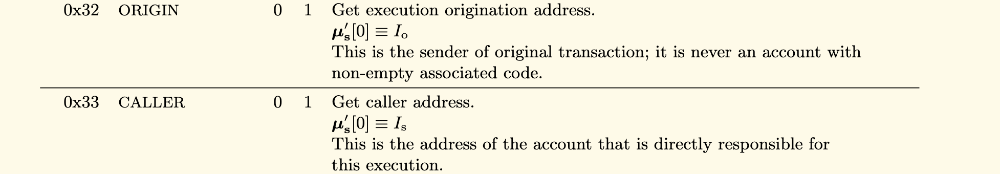
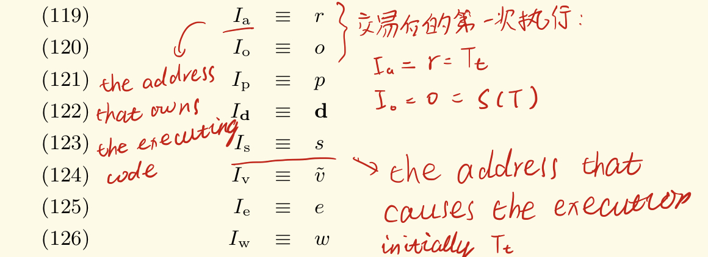
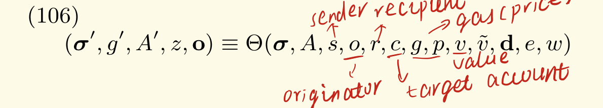
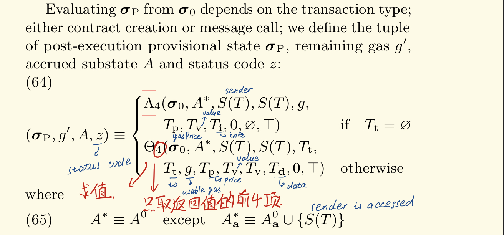
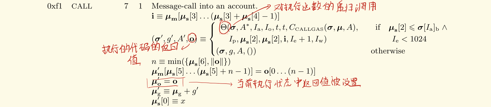

## 4. Telephone

本题较为简单，考察的是message sender以及transaction originator之间的区别。在EVM中，我们可以使用下面这两个指令来获取这两个值：

可以看到，这两个指令是从当前执行环境参数中得到的对应值，我们可以找到Io（交易的发送者地址）和Is（直接导致当前代码被执行这一结果的账户地址）被设置的位置，在黄皮书的式119:

进一步的，这两个值来自message call的执行函数Theta函数的参数o和s，观察Theta函数的原型：

可以看到o和s分别是第四和第三个参数，再去找交易的定义中调用Theta函数的位置：

可以看到初始时这两个参数中o和s都是交易的发送者。

因此我们可以断定任何非合约账户调用合约账户时，被调用者msg.sender == tx.origin恒成立。

然而发生合约间的函数调用时，状况发生了改变：

我们可以看到，o的值仍然是Io，但是s的值变成了Ia，这个参数我们之前还没提到，他表示当前正在执行的合约账户的地址，一个交易中Theta函数被第一次调用时，Ia（来自Theta函数的第5个参数）会被设置成Tt，即交易的接收方。当Theta函数因为合约间函数调用被再度调用时，Ia的值为callee的地址。从而保证任何合约在执行时，Ia的值都是当前合约地址。

到这里我们不难看出，只要让一个合约再去调用目标合约，Io和Is的值就会不同，那么解法就显而易见了。

### 安全问题

如果一个token使用`tx.origin`来判定转账的源账户，那么攻击者就有可能借此实现诱骗攻击。只需诱骗受害者调用恶意合约，在该恶意合约中再调用该token的合约（如向攻击者账户转钱），那么由于`tx.origin`在一次交易内保持不变的性质，我们便可以转走受害者的钱。

